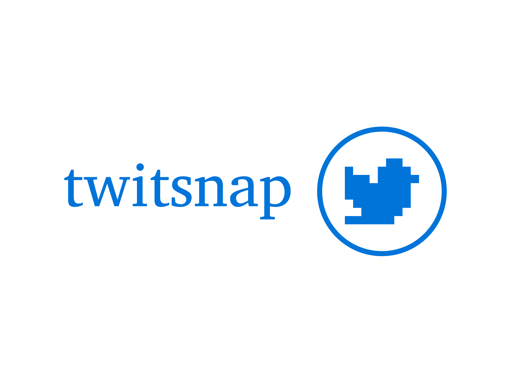

# Twitsnap's snaps service



## Table of content

1. [Introduction](#introduction)
2. [Run the project](#run-the-project)
3. [OpenAPI documentation](#openapi-documentation)
4. [Technologies](#technologies)
5. [Testing](#testing)

## Introduction
This repository contains the snaps service for the application, where each snap with it's media content is stored.

## Run the project
In order to run the project, you should not only run the server but also start the docker container for the database.

### Run the project with npm
To run the project using npm, follow these steps:

1. Create a `.env` file in the root directory of the project with the following content shown in `.env.example` file. Replace the URLs with the actual URLs of the services you want to connect to.

2. Install the dependencies:

   ```bash
   npm install
   ```
3. Start the development server:

   ```bash
   npm run dev
   ```
4. Access the project:

   The snaps service will be available at `http://localhost:<port>`.
   _(Note: The actual `[port]` is defined in your .env file, so make sure it's set properly)_

## OpenAPI documentation

Our API Gateway is fully documented using the OpenAPI standard. You can explore the API's functionality and available endpoints via Swagger UI at the following URL: `http://localhost:<port>/swagger`

_Make sure to replace `<port>` with the port number specified in your .env configuration file._

## Technologies

### Languages

- TypeScript

### Packages

- openapi-fetch: A library for generating API clients from OpenAPI specifications
- dotenv: A zero-dependency module that loads environment variables from a .env file into process.env
- hono: A lightweight HTTP server framework for Node.js
- zod: A TypeScript-first schema declaration and validation library
- prisma: It is used to connect to the database and perform CRUD operations.

## Testing

To run the tests, use the following command:

```bash
npm test
```

To run the tests with coverage, use the following command:

```bash
npm run test:ci
```

To run the tests with coverage and see it displayed in the browser, use the following command:

```bash
npm run test:ui
```
